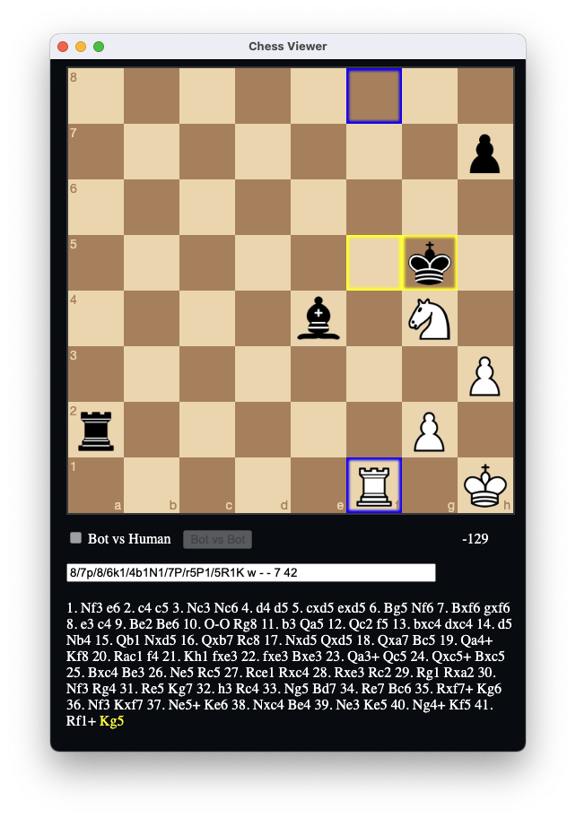

# Chess viewer
A easy-to-use GUI for chess engine powered by [electron](https://www.electronjs.org/).

## Features
- move highlighting
- ponder move highlighting
- engine vs engine
- engine vs human
- very complete time management
- live logs (press 'S' inside the logs window to scroll automatically)
- live score display (whites POV)

## GUI

## Dependencies
- [electron](https://www.npmjs.com/package/electron)
- [wait-for-event](https://www.npmjs.com/package/wait-for-event)
- [jquery](https://www.npmjs.com/package/jquery)